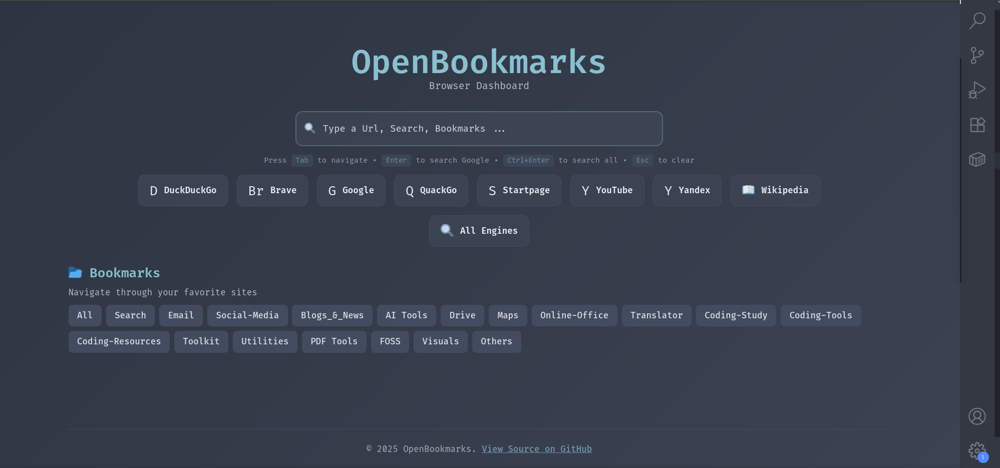

# 🔖 OpenBookmarks - Modern Browser Dashboard

<div align="center">



**A sleek, modern, and customizable homepage for managing and navigating your favorite bookmarks with keyboard shortcuts and search functionality**

[🚀 Live Demo](https://abdulohab61.github.io/) • [🌐 Alternative Link](https://openbookmarkshomepage.netlify.app/)

</div>

## ✨ Features

- 🎯 **Quick Bookmark Access** - Organize and access your favorite websites instantly
- 🔍 **Smart Search** - Search through bookmarks or use multiple search engines
- ⌨️ **Keyboard Navigation** - Full keyboard support for power users
- 🎨 **Beautiful UI** - Modern design with Nord color theme
- 📱 **Responsive Design** - Works perfectly on desktop, tablet, and mobile
- 🔧 **Easy Configuration** - Simple YAML configuration for bookmarks
- 🚀 **Fast & Lightweight** - Built with Vite and TypeScript for optimal performance
- 🌈 **Customizable Categories** - Organize bookmarks with custom categories and colors</div>

## 🚀 Quick Start

### Installation

```bash
# Clone the repository
git clone https://github.com/AbdulOhab/open-bookmarks-homepage.git
cd open-bookmarks-homepage

# Install dependencies
npm install

# Start development server
npm run dev
```

### Build for Production

```bash
# Build the project
npm run build

# Preview the build
npm run preview

# Deploy to GitHub Pages
npm run preview
```

## 📁 Project Structure

```
OpenBookmarks/
├── 📄 index.html              # Main HTML file
├── 📦 package.json            # Dependencies and scripts
├── ⚙️ vite.config.ts          # Vite configuration
├── 🎨 tailwind.config.ts      # Tailwind CSS configuration
├── 📘 tsconfig.json           # TypeScript configuration
├── 📂 src/
│   ├── 🎯 main.ts             # Application entry point
│   ├── 📚 bookmarks.ts        # Bookmark management
│   ├── 🔍 search.ts           # Search engine logic
│   ├── ⌨️ handleKeyboard.ts   # Keyboard navigation
│   ├── 📊 data-loader.ts      # YAML data loading
│   ├── 🛠️ utils.ts            # Utility functions
│   ├── 🎨 css/style.css       # Custom styles
│   └── 📂 assets/
│       └── 🖼️ icon.png        # App icon
└── 📂 public/
    └── 📝 bookmarks.yml       # Bookmark configuration
```

## ⚙️ Configuration

### Adding Bookmarks

Edit `public/bookmarks.yml` to add your bookmarks:

```yaml
bookmarks:
  - title: "GitHub"
    url: "https://github.com"
    category: "dev"
    icon: "🐙"
    description: "Code repositories and collaboration"
```

### Adding Categories

Add new categories to the configuration:

```yaml
categories:
  - "your-category"

categoryColors:
  your-category: "12" # Nord color (0-15)
```

### Search Engines

Modify search engines in `src/search.ts`:

```typescript
export const searchEngines: SearchEngine[] = [
  {
    name: "Your Engine",
    url: "https://yourengine.com/search",
    parameter: "q",
  },
];
```

## 🎹 Keyboard Shortcuts

| Shortcut        | Action                           |
| --------------- | -------------------------------- |
| `Tab`           | Start bookmark navigation        |
| `↑` `↓`         | Navigate through bookmarks       |
| `Enter`         | Open selected bookmark or search |
| `Ctrl+Enter`    | Search in all engines            |
| `Ctrl+Q`        | Select first bookmark            |
| `Escape`        | Clear search and reset           |
| `F5` / `Ctrl+R` | Refresh data                     |

## 🛠️ Tech Stack

- **Frontend**: TypeScript, HTML5, CSS3
- **Styling**: Tailwind CSS with Nord theme
- **Build Tool**: Vite
- **Data Format**: YAML
- **Architecture**: Modular ES6+ modules & TypeScript

## 📝 License

This project is licensed under the MIT License - see the [LICENSE](LICENSE) file for details.
